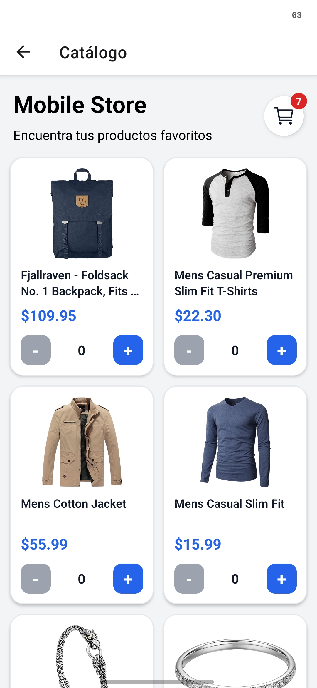
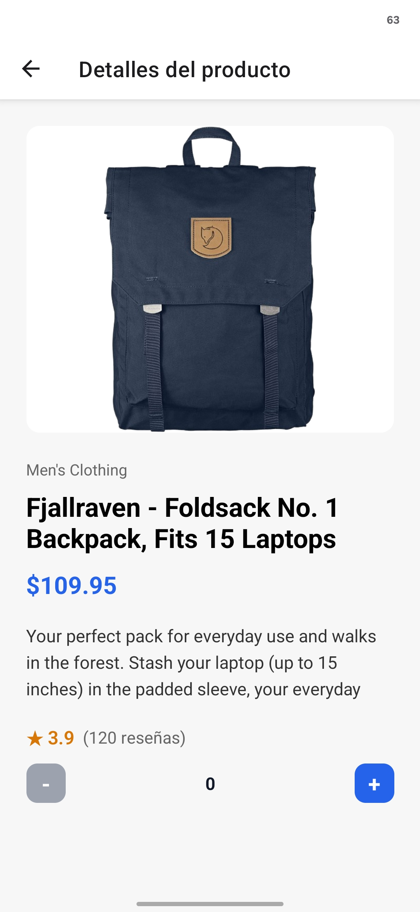
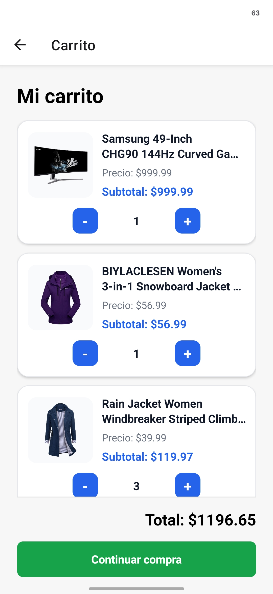
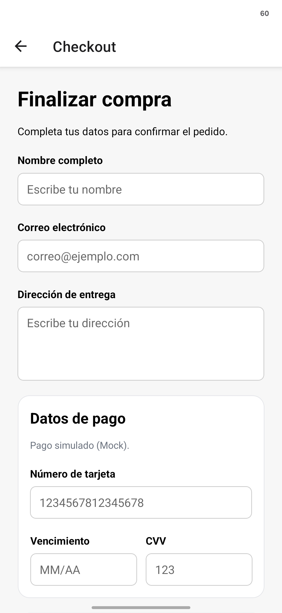
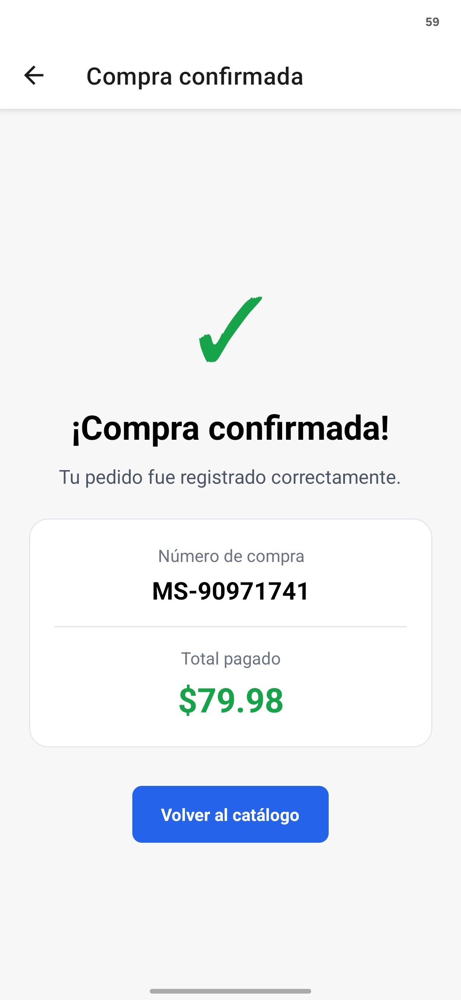

# Mobile Store

Aplicación móvil de comercio electrónico desarrollada con React Native y Expo. Consume Fake Store API para mostrar productos y permite consultar detalles, administrar un carrito y simular un proceso de compra.

## Funcionalidades

- Pantalla de bienvenida.
- Catálogo en cuadrícula de dos columnas.
- Productos obtenidos desde Fake Store API.
- Estados de carga y error.
- Detalle dinámico por producto.
- Carrito global con contador de unidades.
- Incremento y decremento de cantidades.
- Navegación desde el carrito al detalle del producto.
- Subtotal por producto y total general.
- Resumen del pedido en checkout.
- Formulario de entrega y pago simulado con validaciones.
- Confirmación con total pagado y número de compra.
- Limpieza automática del carrito al confirmar.

> El checkout es una simulación. Los datos bancarios solamente existen temporalmente en el estado local del formulario: no se almacenan, no se envían a la API y no se procesa ningún pago real.

## Capturas de la aplicación

<table>
  <tr>
    <th>Bienvenida</th>
    <th>Catálogo</th>
    <th>Detalle del producto</th>
  </tr>
  <tr>
    <td></td>
    <td></td>
    <td></td>
  </tr>
  <tr>
    <th>Carrito</th>
    <th>Checkout</th>
    <th>Confirmación</th>
  </tr>
  <tr>
    <td></td>
    <td></td>
    <td></td>
  </tr>
</table>

## Tecnologías

- Expo SDK 54
- React Native 0.81
- TypeScript
- Expo Router
- TanStack Query
- Zustand
- Fake Store API

## Arquitectura

```text
app/          Pantallas y rutas de Expo Router
components/   Componentes visuales reutilizables
hooks/        Hooks para las consultas de TanStack Query
services/     Comunicación con la API
store/        Estado global del carrito
types/        Tipos de TypeScript
```

## Rutas

| Ruta | Pantalla |
| --- | --- |
| `/` | Bienvenida |
| `/catalog` | Catálogo |
| `/product/[id]` | Detalle dinámico |
| `/cart` | Carrito |
| `/checkout` | Formulario de compra |
| `/success` | Confirmación |

## Flujo principal

1. El usuario entra al catálogo.
2. Agrega productos desde el catálogo o el detalle.
3. Revisa cantidades, subtotales y total en el carrito.
4. Completa sus datos de entrega y pago simulado.
5. Checkout valida los campos, genera un número de compra local y vacía el carrito.
6. La pantalla de confirmación muestra el número de compra y el total pagado.

## Manejo del estado

El proyecto separa el estado según su origen:

- TanStack Query administra los productos recibidos desde la API, junto con sus estados de carga, error y caché.
- Zustand administra el estado local y global del carrito.
- `useState` administra los datos de entrega, los campos de pago simulado y los mensajes de validación.
- Expo Router transporta el total y el número de compra desde checkout hasta la pantalla de confirmación.

El carrito almacena solamente la relación entre el identificador de un producto y su cantidad:

```ts
Record<number, number>
```

Los títulos y precios se obtienen desde TanStack Query. Los subtotales y el total se calculan como datos derivados para evitar duplicar información en el store.

## API

Los productos se obtienen desde:

```text
https://fakestoreapi.com/products
```

Endpoints utilizados:

```text
GET /products
GET /products/:id
```

## Instalación

Requisitos:

- Node.js 20.19 o posterior.
- npm.
- Expo Go, un emulador o un navegador.

Clona el repositorio:

```bash
git clone https://github.com/Marcelo-30/mobile-store-prueba.git
cd mobile-store-prueba
```

Instala las dependencias:

```bash
npm install
```

Inicia el proyecto:

```bash
npx expo start
```

## Scripts

```bash
npm start
npm run android
npm run ios
npm run web
npm run lint
```

## Decisiones técnicas

### Expo Router

Se utilizó navegación basada en archivos para relacionar la estructura de `app/` con las rutas de la aplicación.

### TanStack Query

Se utilizó para separar el estado remoto del estado local, reutilizar los productos almacenados en caché y manejar los estados de carga y error.

### Zustand

Se eligió por su API pequeña y directa para compartir las cantidades del carrito entre catálogo, detalle y carrito sin necesidad de un proveedor adicional.

### Componentes reutilizables

`ProductCard`, `QuantityControl` y `CartItem` separan responsabilidades y evitan repetir la misma lógica visual en diferentes pantallas.

## Mejoras futuras

- Persistir el carrito al cerrar la aplicación.
- Añadir pruebas automatizadas.
- Implementar búsqueda y filtrado.
- Conectar un servicio real de órdenes y pagos.
- Mejorar accesibilidad y retroalimentación visual.